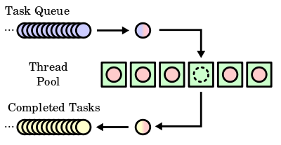

# Java线程池


## 线程池是如何工作的

一个线程池是一些预初始化的线程的集合，这样有助于在相同的线程中执行多个任务。如果任务书多余线程个数，那么任务需要在队列（FIFO——先进先出）中等待。
当任意一个线程执行完成后，它会从队列中挑选要一个任务去执行。当所有的任务已经被执行了，线程依旧处于活跃状态，等待线程池中更多的任务。


## ThreadPoolExecutor

自从Java5开始Java提供了Executor framework的机制。它主要包括Executor接口，和它的子接口Executor
Service,以及实现类ThreadPoolExecutor。ThreadPoolExecutor分隔任务的创建和执行。通过ThreadPoolExecutor你只需要将实现了Runnable接口的对象发送给执行者。如下图所示：



## 如何创建一个ThreadPoolExecutor
在`java.util.concurrent.Executors`接口中已经预定义了可以创建5种类型线程池执行器的方法。

1. **Fixed thread pool executor**

    创建固定个数的可重用的线程来执行任务的线程池。当所有线程都处于激活状态时还有其它任务需要执行，那么待执行任务需要在队列中等待，直到线程可用。
    ``` java
    ThreadPoolExecutor executor = (ThreadPoolExecutor) Executors.newFixedThreadPool(10);
    ```
2. **Cached thread pool executor**
    
    创建一个当需要线程的时候就可以创建一个线程的线程池，当之前已经构造好的线程可用的时候（空闲）那么它会被重用。当任务需要长时间执行的时候一定不要不要使用这个线程池，因为如果有多个这样的任务可能导致系统宕机。
    ``` java
    ThreadPoolExecutor executor = (ThreadPoolExecutor) Executors.newCachedThreadPool();
    ```
3. **Scheduled thread pool executor**
   
   创建一个可定时执行任务的线程池
   ``` java
   ThreadPoolExecutor executor = (ThreadPoolExecutor) Executors.newScheduledThreadPool(10);
   ```

4. **Single thread pool executor**

    创建一个只有一个线程的线程池。当只有一个任务的时候使用这个线程池。

    ``` java
    ThreadPoolExecutor executor = (ThreadPoolExecutor) Executors.newSingleThreadExecutor();
    ```
5. **Work stealing thread pool executor**

    创建一个可以将所有可用的处理器作为最大并行数的线程池。

    ``` java
    ThreadPoolExecutor executor = (ThreadPoolExecutor) Executors.newWorkStealingPool(4);
    ``` 


## ThreadPoolExecutor实例

这里只演示固定线程个数的线程池，创建一个线程大小为5的线程池，然后让10个任务在线程池中执行，代码如下图所示：


上述代码运行结果如下：


前5行表示5个任务在5给线程中开始执行；6-9行表示有3个任务已经执行完成，10-12行队列中的任务7、8、6进入线程中开始启动......从图中可以看出最大的线程数为5，当任务执行结束后就会继续执行线程池队列中的其他任务，直到任务全部结束。


