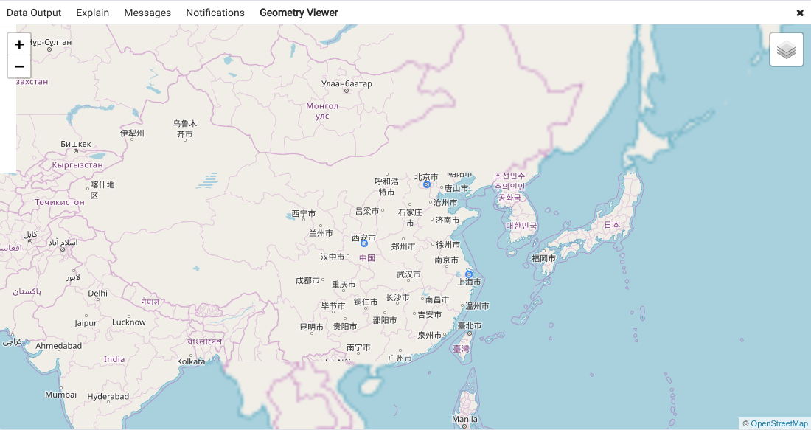

# 安装Postgresql

## 安装
``` bash
sudo aptitude install postgresql-10
```

## 配置Postgresql


## 为Postgresql创建用户和数据库

先切换到postgres用户

``` bash
sudo su - postgres
```

### 创建用户
``` bash
createuser dbuser1
```
创建完用户设置用户的密码

``` bash
postgres=# \password dbuser1
Enter new password: 
Enter it again: 
```

### 创建数据库
``` bash
createdb testdb -O dbuser1
```
创建完成后查看创建的数据库
``` bash
postgres=# \l
```
### 登录数据库
``` bash
psql -U dbuser1 -d testdb -h 127.0.0.1 -p 5432
```
测试登录成功后，就可以使用图形化数据库管理工具进行连接到数据库了。

# 安装PostGIS


## 安装包

``` bash
sudo apt install postgresql-10-pgrouting
```

## 为数据库添加PostGIS扩展

需要切换到postgres用户中，然后切换到testdb数据库中

``` bash
sudo su - postgres
psql -d testdb
```

验证PostGIS的安装情况

``` bash
SELECT PostGIS_version();
```
添加完PostGIS扩展之后，会有一个`spatial_ref_sys`的表。

# 测试地理数据

## 安装pgadmin4

pgadmin4中可以将查询的地理信息可以有好地显示在`OpenStreetMap`上。


## 创建表

创建业务表：
``` sql
create table Cell
(
	id serial,
	lat double precision,
	long double precision
);
```
添加地理信息：
``` sql
alter table latLng add column geom geometry(Point,4326);

update cell set geom = ST_SetSRID(ST_MakePoint(long, lat), 4326);
```
添加若干经纬度信息：

``` sql
insert into cell(lat, long) values(34.53832100,110.24313400);

insert into cell(lat, long) values(34.53833200,110.24312700);

insert into cell(lat, long) values(34.53831600,110.24313500);
```
根据经纬度信息生成geometry：
``` sql
update cell set geom = ST_SetSRID(ST_MakePoint(long, lat), 4326);
```

## 点的操作

## 线