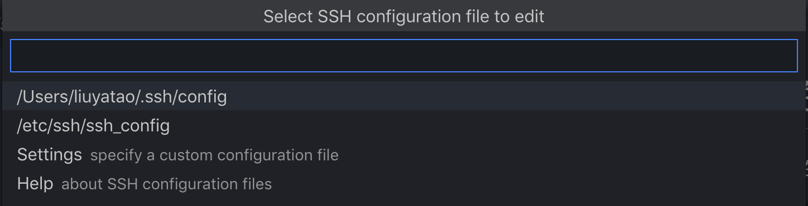
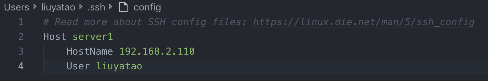

# 概述
Visual Studio Code(以下简称 VS Code)从1.35.0版本正式提供可以在本地编辑远程开发环境的文件的功能，具体实现如下图：


本实验使用Ubuntu Server 18.04作为远程开发环境，MacOS作为本地机器。目标是能够在安装VS Code的MacOS上编辑远程开发环境的文件。

# 配置免密远程登录

在本地机器生成密钥对：

``` bash
ssh-keygen -t rsa -C "739697044@qq.com"
```
生成的路径在`~/.ssh/`

将公钥拷贝到服务器上：

``` bash
ssh-copy-id liuyatao@192.168.2.110
```
添加完后要登录服务器就只需输入`liuyatao@192.168.2.110`就可以直接进入服务器，不需要密码。


# VS Code远程开发扩展

在VS Code扩展商店中搜索`remote`安装`Remote Development`即可。


# 使用

使用`cmd+shift+p`的快捷键调用命令，执行`Remote-SSH:Connect to Host...`,然后选择配置文件的路径



然后输入主键信息：



再接着执行`Remote-SSH:Connect to Host`的命令即可连接到服务器。

连接成功就可以像在编辑本地文件一样的编辑远程文件了。


